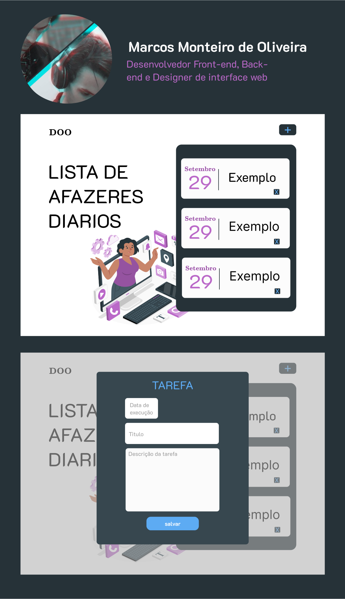

<h1 align="center">Lista de tarefas</h1>
 

    

 

 Este é um projeto de lista de tarefas desenvolvido 100% por mim e para treino dos meus estudos 

 
 

## TECNOLOGIAS UTILIZADAS

 
 

Foram utlizados as seguintes tecnologias.
### HTML
### CSS
### JS

 
 

## PREVIEW

